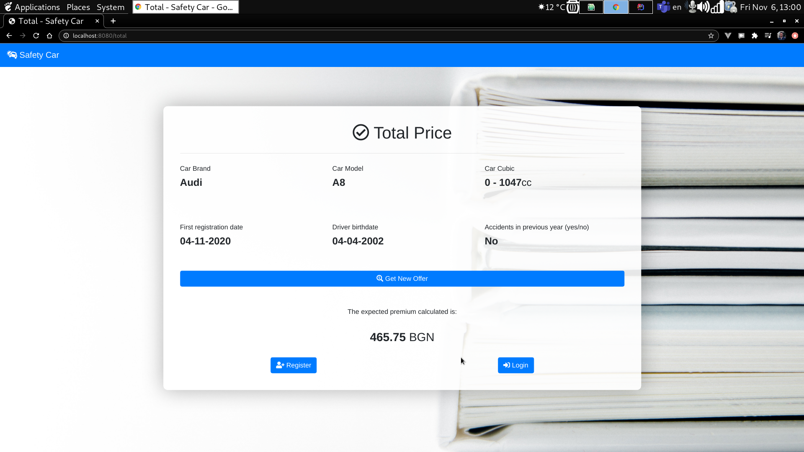
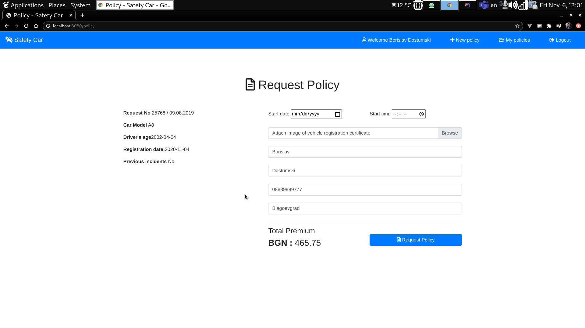
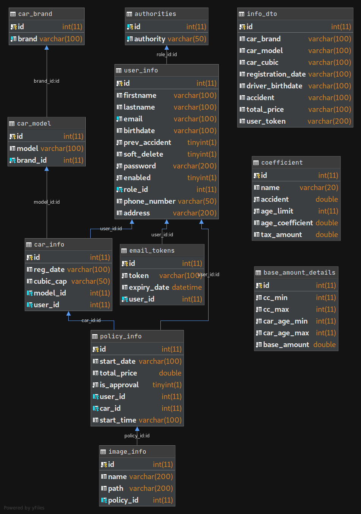
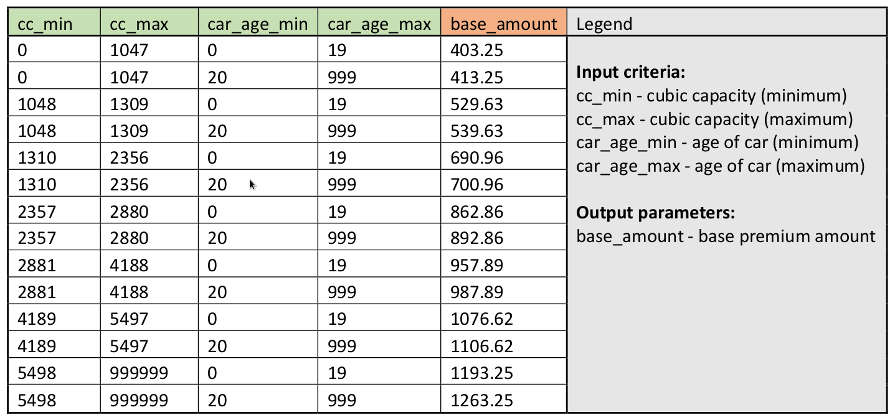

# Safety Car Insurance application for Web & REST

## Project Description

**SAFETY CAR** is a WEB and REST application. It is insurance-oriented application for the end users. It allows simulation of amount and request insurance policies online. The application functionalities are related to three different type of users: public, private and administrators.

**CAR SAFE** is a Mobile application for Android that consumes the REST API, and was also developed for the project.

<a href="https://gitlab.com/dimilkin/carsafeandroidproject">CAR SAFE Android App</a>

The **public part** of application should be visible without authentication. It should provide the following functionalities:

  - Simulate of car insurance offer based on some input criteria
  - Creation of new account and log-in functionality

The **private part** of application is for registered users only and should be accessible after successful login. The main functionalities provided for this area are:

  - Send request for approval of offer (request policy)
  - List history of user’s requests

The **administrators** of the system should have permission to manage all major information objects in thes ystem. The main functionalities provided for this area are:

  - List of requests created in the system
  - Approval or rejection of the requests

## Screenshots
<table>
<tr>
<td></td>
<td></td>
</tr>
<tr>
<td></td>
<td></td>
</tr>
<tr>
<td></td>
<td></td>
</tr>
<tr>
<td colspan="2"></td>
</table>

## Business Glossary
<table style="width:100%;">
<tr><th>Term</th><th>Description</th></tr>
<tr><td>Offer (Quote)</td><td>An estimate of expected value of insurance policy</td></tr>
<tr><td>Insurance Policy</td><td>A legal contract between insurer and insured person</td></tr>
<tr><td>Net premium</td><td>The amount of insurance policy to be paid by the client before taxes</td></tr>
<tr><td>Total Premium</td><td>The final amount of insurance policy to be paid by the client after taxes</td></tr>
</table>

## Functional Description
In the following sections different functionalities will be described in more details.

### Create Account
This functionality should be accessible only from **public part** of the application.

Implement a page to register user in the system. The minimal data to be entered are a valid email address as username and password.

**Optional functionalities:**
   - Completion of registration via email confirmation link
   - Provide constraints to create safe password

### Simulate Offer
This functionality should be accessible from **public and private part**.
Implement a page – **simulation form**, where user should input specific parameters for its car and visualize the amount of expected total premium.

Simulation form should contain these business inputs:

  - car (brand and model)
  - cubic capacity
  - first registration date
  - driver age
  - accidents in previous year (yes/no)

After click on simulate button, the expected premium should be calculated and shown on the screen.

The calculation of premium amount (**totalPremium**), is based on the following rules:

**totalPremium = netPremium + taxAmount**, where:

  - netPremium = baseAmount * accidentCoeff * driverAgeCoeff
  - taxAmount = 10% of netPremium

The calculation of net premium (**netPremium**) is based on the following parameters:

  - **baseAmount** - amount which is calculated depending on two criteria from input form: cubic capacity and first registration date. Both input criteria parameters are range based (see details below)
  - **accidentCoeff** – increase amount with 20% if there is an accident in previous year. The answer of form input parameter to be used.
  - **driverAgeCoeff** - increase amount with 5% if driver is under 25 years old

For the calculation of the base amount you can use the following values in the multicriteria range table:

Example: cubic capacity = 1400, car age = 10 => base amount = 690.96.

When the total premium amount is calculated, the user has the possibility to request this offer for approval. If the user has not been logged in, the system should force him to log in. If the user is logged,
he automatically will be redirected to the page for policy request preparation.

**Optional functionalities:**

  - Apply business controls to check data validity

### Request policy
This functionality should be accessible only from **private part** of the application.

In order to issue a final policy, additional details are needed. A new page to be created in order to gather the following information:

  - effective date of the policy
  - attachment of image of vehicle registration certificate
  - communication details: email, phone, postal address

All details from the simulated offer should be visible in the page.

Once the policy is requested it should be stored in the system for further management. At that stage request becomes in state “pending” and should be treated by the administrators of the system.

**Optional functionalities:**

  - Apply business controls to check data validity

### User’s Request History
This functionality should be accessible only from **private part** of the application.

Implement a page to display list of all policy requests for the logged user with their details. The history of all requests to be shown (pending, approved and rejected) and chronologically sorted.

**Optional functionalities:**

  - The user can cancel requests which are pending (not treated by administrator)

### Manage Requests
This functionality should be accessible only from **administration part** of the application.

Implement a page to display list of all pending requests in the system with their details. The administrator should be able to accept or reject the request.

**Optional functionalities:**

  - Possibility to filter requests by different criteria (user, request date, etc.)
  - The data of multicriteria range table to be configured and loaded from external source
  - Send email to the user in case of approval/rejection of the request

## Technical Requirements

### General guidelines

  - Following **OOP** principles when coding
  - Following **KISS, SOLID, DRY** principles when coding
  - Following **REST API** design best practices when designing the REST API (use Postman)

### Database
The data of the application is stored in a relational database – **MariaDB**.

### Backend

  - **JDK version 11**
  - **SpringMVC** and **SpringBoot** framework
  - **Hibernate** in the persistence (repository) layer
  - **Spring Security** to handle user registration and user roles

### Frontend

  - **Spring MVC Framework with Thymeleaf template engine** for generating the UI
  - AJAX for making asynchronous requests to the server between Car Brand and Car Model
  - Bootstrap

### Deliverables

  - <a href="https://gitlab.com/b.dostumski/insurance">Use Git</a>  
  - <a href="https://trello.com/b/1n3wCQk4/carsafe">Use Trello board</a>
  - <a href="https://www.youtube.com/watch?v=mUGKc6mLlOw&t=374s">Video</a>

## Team
<table>
<tr>
<th>Dimitar Milkin</th>
<th>Borislav Dostumski</th>
</tr>
<td></td>
<td></td>
</table>
